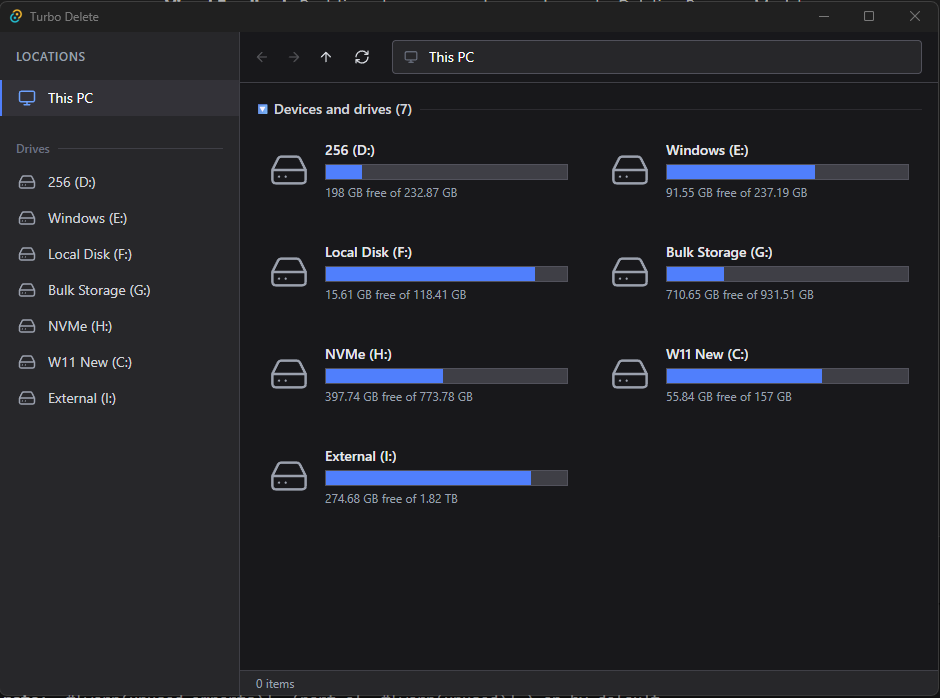

# Turbo Delete GUI 🚀

**Turbo Delete** is a blazing fast, modern file deletion utility for Windows. Built with **Rust** (Tauri) and **React** (TypeScript), it creates a native-feeling experience that allows you to rapidly delete massive directories that Windows Explorer struggles with.



## ✨ Features

- **⚡ Turbo Mode**: Uses parallel processing to delete thousands of files per second.
- **🛡️ Protected Deletion**: Automatically takes ownership and strips "Read-Only"/"Hidden" attributes to delete stubborn files (e.g., old Windows installs).
- **🎨 Modern UI**: Specific dark mode design that matches Windows 11 aesthetics.
- **📊 Visual Feedback**: Real-time storage usage bars and granular deletion progress modal.
- **🖱️ Drag Selection**: Intuitive click-and-drag multi-selection.
- **🔒 Safety First**: Custom confirmation dialogs and "Devices" view to prevent accidental wiping of critical drives.

## 📥 Installation

Download the latest installer from the [Releases](https://github.com/master-moose/turbodelete-gui/releases) page.

## 🛠️ Development

### Prerequisites
- [Node.js](https://nodejs.org/) (v16+)
- [Rust](https://www.rust-lang.org/) (v1.70+)
- [Build Tools for Visual Studio](https://visualstudio.microsoft.com/visual-cpp-build-tools/) (C++ workload)

### Setup

1. **Clone the repository**
   ```bash
   git clone https://github.com/master-moose/turbodelete-gui.git
   cd turbo-delete
   ```

2. **Install dependencies**
   ```bash
   npm install
   ```

3. **Run in Development Mode**
   ```bash
   npm run tauri dev
   ```

4. **Build for Production**
   ```bash
   npm run tauri build
   ```
   The installer will be generated in `src-tauri/target/release/bundle/nsis/`.

## 📜 Credits

- Original core concept and deletion logic by [Tejas Ravishankar (suptejas)](https://github.com/suptejas).

## 📄 License

This project is licensed under the **Apache License 2.0**. See the [LICENSE](LICENSE.txt) file for details.
